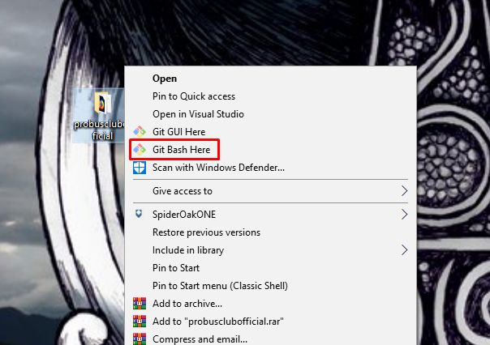
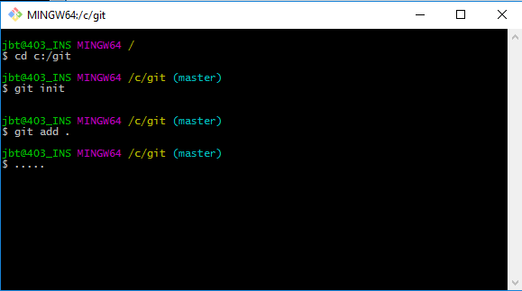
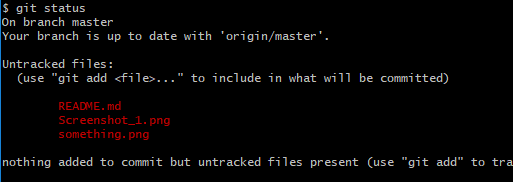
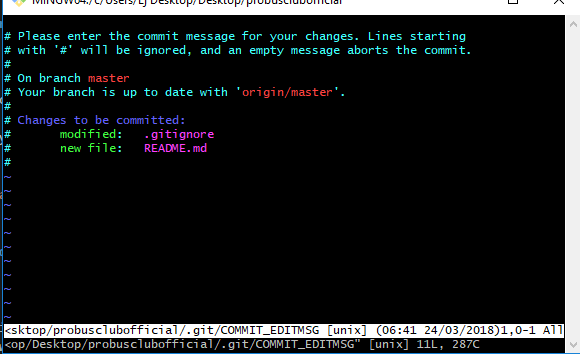
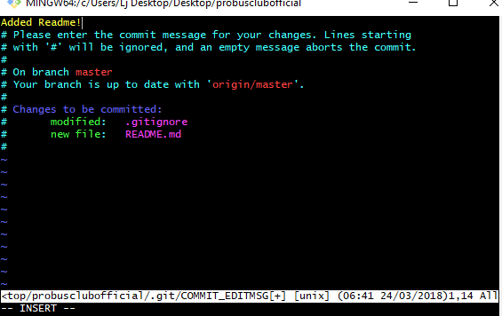
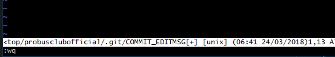
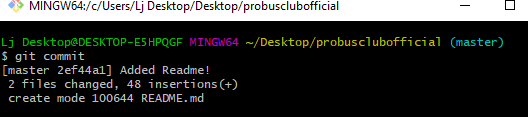

# Probus Club Website

This repository was created for the Computing: Project Level 6 unit.

# Tasks List

## Design

* [x] 1. Design Document
    * [x] 1.1 Written Summary
    * [x] 1.2 Diagrams (wireframe and layout)
    * [ ] 1.3 Colour Scheme Justification (add a line to presentation justifying the colour scheme we are using)

## Specification

* [x] 2. Specification Document
    * [x] 2.1 Clear Outlined Purpose
    * [ ] 2.2 List of Resources (needs to be expanded)
    * [x] 2.3 Summary of techniques planned to be used
    * [x] 2.4 Includes explanation of what is required

## Implementation

* [x] 3. Markup Template
    * [x] 3.1 Navigation Bar
    * [x] 3.2 Content Area Defined
    * [x] 3.4 Footer Contains Logo
    * [x] 3.5 Matches Design Doc

* [ ] 4. Markup individual pages
    * [ ] 4.1 Pages Include all relevant content

* [ ] 5. Add CSS to individual pages
   * [ ] 5.1 Matches Design Doc
   * [ ] 5.2 Images are Responsive
   * [ ] 5.3 Consistent Colour Scheme
   * [ ] 5.4 Readable Class Names

* [ ] 6. Add Javascript and Functionality to website
    * [ ] Login System Complete
    * [ ] Forms operational (or shown to be implemented in future)
    
 

---

<!-- Github Tutorial -->

## Github & Git basics Reminder

### Installing Git
> Go to the [github download page](https://git-scm.com/downloads) and download the correct version for your OS

### Using Git 
If you're starting a respository for the first time, right click the folder where you wish to create it and click "Git Bash Here"

If you've done this correctly, you should see a terminal similar to cmd, it will look something like this:

## Commands

### Intializing your git repository - just don't blow it up

> git init 

* In order to intialize a git repository we must start with this command, it will create a .git folder (its hidden by default) which contains the relevent files
* If you've cloned this respository, there's no need to run this command as the repository already exists

### Config commands - telling git all your secrets

> git config --global user.name [name]
    
* In order to push to a remote repository you must enter your name, it will be stored in a config file as shown above.

> git config --global user.email [email]

* same as above your email is required, it will also be stored in the config file

> git status

* This will show all the files that git hub has detected, if you haven't made any commits they will be highlighted in red as they are not in the staging area (ready to be committed)

### Adding files to the staging area - woo the fun stuff

> git add [filename] or git .

* This will add files you wish to commit to the staging area, if you wish to add all of them at once you can do git .
* If you've added them correctly, you should now see the files highlighted in red are green

")

### Committing your changes - no drug files please

> git commit -m "comment"

* This is how you commit changes with git, "-m" will allow you to bypass the messy vim editor which is disgusting. However, I will leave below how to do it that way as well.
* After the -m you simply put a meaningful comment like "I changed index.html" or "files in Images updated"
* If you've done this and seen a message saying the changes were made, you can ignore the stuff below.

### The messy way

> git commit

* After you've run this command you will see a window similar to this:

* First press insert on your keyboard and type your comment in a space without a "#" as this is a comment and will be ignored 

* Afterwards, press escape and type :wq then hit enter:

* Well done, you have managed to survive this disgusting mess, and you should see a familiar window showing you have made the commit:

### Pushing to a remote respository & Creating Branches (kind of)

Depending on the remote repository you use, the link may be slightly different (this assumes you are creating a new remote repository) github is used here.

* First go to [Githubs Website](https://github.com "Githubs Home Page") and create an account
* There is a plus icon next to your account name, click that.
* Click "Create new Repository", it will give you an option for public or private you will have to pay for the private option so I recommend using public

> git remote add origin https://github.com/ljsgithub/testrepository.git

* This will add the remote repository

> git push -u origin master

* This will push everything in master to the remote repository 

### Cloning a Repository

If you're working on a repository with other people, and it wasn't created by you it will already have a master branch, and as such you can't create another one. In order to access the repository files you simply use:

> git clone https://github.com/ljsgithub/testrepository.git

* this will pull the files from the repository down, if you then bash this folder you can manipulate the repository (remember you have to do the config commands and you must be authorized as a contributor in order to continue)

### Setting up Branches

> git branch [branchname]

* This will create a branch, different branches are used to seperate files from the main code base.

> git checkout [branchname]

* This will switch you to the branch you specify 

> git push 

* Pushes to a remote repository (you may have to do -u origin the first time)

> git pull
* Pulls from a remote repository
